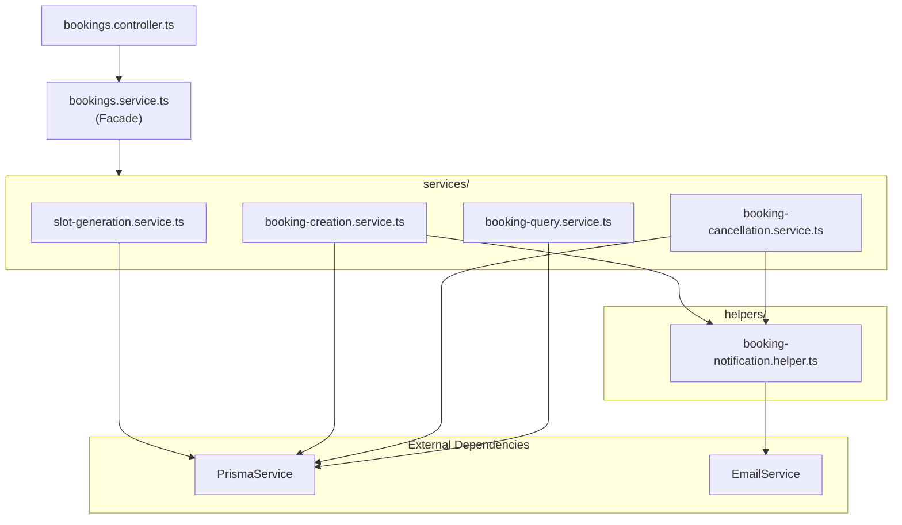

# Refactoring Plan: `bookings.service.ts`

## Current State

The file [`bookings.service.ts`](backend/src/bookings/bookings.service.ts) is **1580 lines** long and contains **all booking logic** in a single class `BookingsService`. It mixes multiple responsibilities:

| Responsibility                           | Lines | Methods                                      |
| ---------------------------------------- | ----- | -------------------------------------------- |
| **Slot generation & availability**       | ~230  | `getAvailableSlots()`, `generateTimeSlots()` |
| **Booking creation** (authenticated)     | ~190  | `createBooking()`                            |
| **Guest booking creation**               | ~170  | `createGuestBooking()`                       |
| **Manual booking creation** (instructor) | ~180  | `createManualBooking()`                      |
| **Booking queries**                      | ~85   | `getMyBookings()`, `getBookingById()`        |
| **Status transitions**                   | ~100  | `confirmBooking()`, `completeBooking()`      |
| **Cancellation** (authenticated)         | ~170  | `cancelBooking()`                            |
| **Guest cancellation** (token-based)     | ~150  | `cancelGuestBooking()`                       |
| **History management**                   | ~20   | `clearUserHistory()`                         |
| **Manual block creation**                | ~65   | `createManualBlock()`                        |
| **Notes update**                         | ~30   | `updateBookingNotes()`                       |
| **Token cleanup**                        | ~15   | `cleanupExpiredCancellationTokens()`         |
| **Cancellation acknowledgement**         | ~30   | `acknowledgeCancellation()`                  |

## Problems Identified

1. **Single responsibility violation** — one class handles slot generation, booking CRUD, cancellations, email notifications, and cron-like cleanup
2. **Massive duplication** — the same validation patterns (check instructor exists, check booking enabled, check overlapping bookings, check notice period) are repeated across `createBooking`, `createGuestBooking`, `createManualBooking`
3. **Email notification logic mixed in** — every creation/cancellation method directly calls `this.emailService.*` with inline formatting, making it hard to test or change email flows
4. **Hard-to-read slot generation** — `generateTimeSlots()` is a 220-line monolithic method with deeply nested loops and conditionals
5. **No typed return values** — many methods use `any[]` for internal types (e.g., `weeklyAvailability: any[]`)
6. **Mixed concerns in cancellation** — `cancelBooking()` and `cancelGuestBooking()` both handle validation, transaction, AND email formatting/notification

## Proposed Architecture

Split into **4 focused services** + **1 utility class**:

```
backend/src/bookings/
├── bookings.module.ts          # Updated: registers all new providers
├── bookings.controller.ts      # Unchanged (already clean)
├── bookings.constants.ts       # Unchanged
├── bookings-cron.service.ts    # Unchanged
├── bookings.service.ts         # Facade — delegates to sub-services (kept for backward compat)
├── services/
│   ├── slot-generation.service.ts      # generateTimeSlots(), getAvailableSlots()
│   ├── booking-creation.service.ts     # createBooking(), createGuestBooking(), createManualBooking()
│   ├── booking-cancellation.service.ts # cancelBooking(), cancelGuestBooking()
│   └── booking-query.service.ts        # getMyBookings(), getBookingById()
├── helpers/
│   └── booking-notification.helper.ts  # All email formatting & sending logic
└── types/
    └── booking.types.ts                # Shared TypeScript interfaces
```

### Detailed Breakdown

#### 1. [`slot-generation.service.ts`](backend/src/bookings/services/slot-generation.service.ts)

**Move from:** `getAvailableSlots()`, `generateTimeSlots()`
**Responsibility:** All availability/slot logic

- `getAvailableSlots(instructorProfileId, startDate, endDate, requestingUserId?, timezoneOffset?)`
- `generateTimeSlots(...)` — private, pure algorithm
- Extract the `clientName` formatting helper into a shared utility
- Add proper TypeScript interfaces for weekly availability and exceptions instead of `any[]`

#### 2. [`booking-creation.service.ts`](backend/src/bookings/services/booking-creation.service.ts)

**Move from:** `createBooking()`, `createGuestBooking()`, `createManualBooking()`, `createManualBlock()`
**Responsibility:** All booking creation flows

- Extract shared validation methods:
  - `validateInstructorProfile(instructorProfileId)` — checks exists + booking enabled
  - `checkOverlappingBooking(instructorUserId, startTime, endTime)` — race-condition check
  - `checkNoticePeriod(startTime, minNoticeHours)` — returns `isShortNotice`
- Each creation method calls these shared validators
- Email notifications delegated to `BookingNotificationHelper`

#### 3. [`booking-cancellation.service.ts`](backend/src/bookings/services/booking-cancellation.service.ts)

**Move from:** `cancelBooking()`, `cancelGuestBooking()`, `acknowledgeCancellation()`
**Responsibility:** All cancellation flows

- `cancelBooking(bookingId, userId, dto, language?)`
- `cancelGuestBooking(bookingId, token, cancellationReason?, language?)`
- `acknowledgeCancellation(userId, bookingId)`
- `cleanupExpiredCancellationTokens()` — stays here or in cron service
- Shared validation: `validateCancellationDeadline()`, `validateBookingStatusForCancellation()`
- Email notifications delegated to `BookingNotificationHelper`

#### 4. [`booking-query.service.ts`](backend/src/bookings/services/booking-query.service.ts)

**Move from:** `getMyBookings()`, `getBookingById()`, `clearUserHistory()`, `updateBookingNotes()`, `confirmBooking()`, `completeBooking()`
**Responsibility:** Read operations and simple status transitions

- `getMyBookings(userId, role)`
- `getBookingById(bookingId, userId)` — with access control
- `clearUserHistory(userId)`
- `updateBookingNotes(userId, bookingId, notes)`
- `confirmBooking(bookingId, userId)`
- `completeBooking(bookingId, userId)`

#### 5. [`booking-notification.helper.ts`](backend/src/bookings/helpers/booking-notification.helper.ts)

**Move from:** All inline email formatting/sending logic scattered across methods
**Responsibility:** Centralized email notification dispatch

- `sendBookingConfirmation(booking, language)` — handles both client + guest + instructor
- `sendCancellationNotification(booking, cancelledBy, language)`
- `sendManualBookingNotification(booking, language)`
- All `toLocaleDateString` / `toLocaleTimeString` formatting in one place
- All `.catch(err => console.error(...))` in one place

#### 6. [`booking.types.ts`](backend/src/bookings/types/booking.types.ts)

**New file:** Shared TypeScript interfaces

- `TimeSlot` — the slot object returned by `getAvailableSlots`
- `WeeklyAvailabilitySlot` — typed version of `any[]`
- `AvailabilityExceptionSlot` — typed version
- `BookingWithRelations` — Prisma include result types

### Data Flow Diagram



### Migration Strategy

The refactoring should be done in **5 sequential steps**, each producing a working state:

| Step  | What                                                                 | Files Changed            | Testable After?                    |
| ----- | -------------------------------------------------------------------- | ------------------------ | ---------------------------------- |
| **1** | Create `booking.types.ts` with shared interfaces                     | New file                 | No (just types)                    |
| **2** | Create `booking-notification.helper.ts` — extract all email logic    | New file                 | Yes — can verify emails still send |
| **3** | Create `slot-generation.service.ts` — move slot methods              | New file + update module | Yes — slot availability endpoint   |
| **4** | Create `booking-creation.service.ts` — move creation methods         | New file + update module | Yes — booking creation endpoints   |
| **5** | Create `booking-cancellation.service.ts` — move cancellation methods | New file + update module | Yes — cancellation endpoints       |
| **6** | Create `booking-query.service.ts` — move remaining methods           | New file + update module | Yes — all query endpoints          |
| **7** | Convert `bookings.service.ts` to a Facade that delegates             | Modified file            | Yes — full regression              |
| **8** | Update `bookings.module.ts` to register new providers                | Modified file            | Yes                                |

### Key Design Decisions

1. **Facade pattern** — The original `BookingsService` is kept as a thin facade that delegates to sub-services. This means the controller and any other service importing `BookingsService` don't need to change. The facade can be removed in a future cleanup once all consumers are updated.

2. **No shared state** — Each sub-service is stateless and injects only `PrismaService` (and `EmailService` where needed via the notification helper). No circular dependencies.

3. **Backward-compatible signatures** — All public method signatures remain identical, so the controller and tests don't need changes.

4. **Incremental testability** — Each step produces a working state, so changes can be committed and tested incrementally rather than one giant PR.

### What Stays the Same

- [`bookings.controller.ts`](backend/src/bookings/bookings.controller.ts) — no changes needed
- [`bookings.constants.ts`](backend/src/bookings/bookings.constants.ts) — no changes needed
- [`bookings-cron.service.ts`](backend/src/bookings/bookings-cron.service.ts) — no changes needed
- All DTOs — no changes needed
- All method signatures exposed to the controller — unchanged
